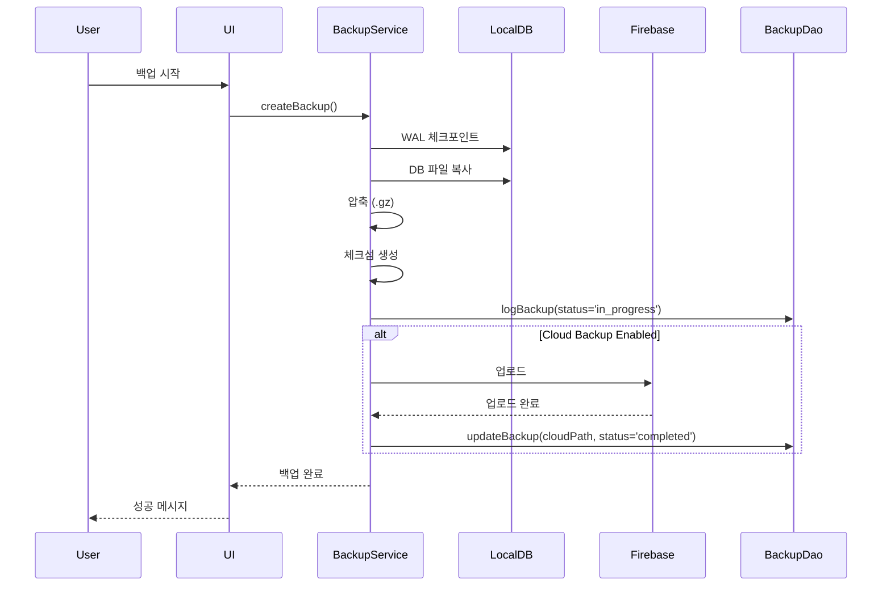
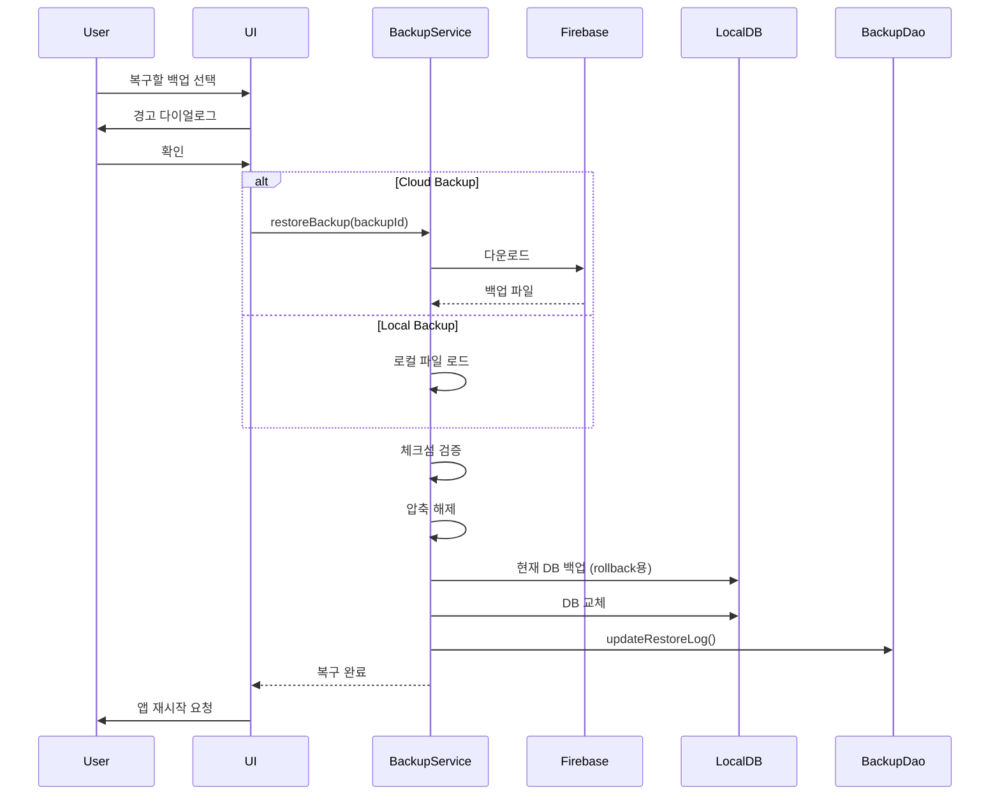

# 클라우드 백업 & 복구 기능 설계서

## 1. 개요

### 1.1 목적
- POS 시스템의 중요 데이터를 클라우드에 자동/수동 백업
- 재해 복구(Disaster Recovery) 시나리오 지원
- 데이터 손실 방지 및 비즈니스 연속성 보장

### 1.2 범위
- 로컬 SQLite 데이터베이스 전체 백업
- Firebase Cloud Storage를 백업 저장소로 사용
- 자동 백업 스케줄링 (일일/주간/월간)
- 수동 백업 트리거
- 백업 이력 관리 및 복구 기능
- 백업 암호화 (선택사항)

## 2. 기술 스택

### 2.1 백업 저장소
```yaml
Firebase Cloud Storage:
  - 파일 스토리지 서비스
  - 보안 규칙 설정 가능
  - REST API 지원
  - 자동 중복 제거 및 압축
```

### 2.2 백업 형식
```
백업 파일명: backup_YYYYMMDD_HHMMSS.db
압축: .db.gz (gzip 압축)
메타데이터: backup_YYYYMMDD_HHMMSS.json
```

## 3. 데이터베이스 설계

### 3.1 신규 테이블: backup_logs

```dart
class BackupLogs extends Table {
  IntColumn get id => integer().autoIncrement()();

  // 백업 정보
  TextColumn get backupId => text().unique()(); // 'backup_20240207_143022'
  TextColumn get backupType => text()(); // 'auto' | 'manual'
  TextColumn get status => text()(); // 'in_progress' | 'completed' | 'failed'

  // 파일 정보
  TextColumn get fileName => text()();
  IntColumn get fileSize => integer()(); // bytes
  TextColumn get cloudPath => text().nullable()(); // Firebase Storage path
  TextColumn get checksum => text().nullable()(); // SHA-256 for integrity

  // 메타데이터
  IntColumn get recordCount => integer().nullable()(); // 총 레코드 수
  TextColumn get databaseVersion => text()(); // schema version
  TextColumn get metadata => text().nullable()(); // JSON: tables, sizes, etc

  // 타임스탬프
  DateTimeColumn get createdAt => dateTime().withDefault(currentDateAndTime)();
  DateTimeColumn get uploadedAt => dateTime().nullable()();

  // 복구 정보
  DateTimeColumn get lastRestored => dateTime().nullable()();
  IntColumn get employeeId => integer().nullable()();
}
```

### 3.2 신규 테이블: backup_settings

```dart
class BackupSettings extends Table {
  IntColumn get id => integer().autoIncrement()();

  TextColumn get settingKey => text().unique()();
  TextColumn get settingValue => text()();
  TextColumn get settingType => text(); // 'bool', 'int', 'string'
  TextColumn get description => text().nullable()();

  DateTimeColumn get updatedAt => dateTime().withDefault(currentDateAndTime)();
}
```

**초기 설정값**:
```dart
{
  'auto_backup_enabled': 'true',
  'backup_frequency': 'daily', // 'daily' | 'weekly' | 'monthly'
  'backup_time': '02:00', // HH:mm
  'max_backups_to_keep': '30',
  'backup_on_close': 'false',
  'cloud_backup_enabled': 'true',
  'encryption_enabled': 'false',
}
```

## 4. 아키텍처

### 4.1 레이어 구조

```
┌─────────────────────────────────────┐
│      Presentation Layer             │
│  ├─ BackupDashboardScreen          │
│  ├─ BackupHistoryScreen            │
│  ├─ BackupSettingsScreen           │
│  └─ RestoreConfirmDialog           │
└─────────────────────────────────────┘
              ↓
┌─────────────────────────────────────┐
│         Service Layer               │
│  ├─ BackupService                  │
│  │   ├─ createBackup()             │
│  │   ├─ uploadBackup()             │
│  │   ├─ downloadBackup()           │
│  │   ├─ restoreBackup()            │
│  │   └─ scheduleAutoBackup()       │
│  └─ BackupEncryptionService        │
└─────────────────────────────────────┘
              ↓
┌─────────────────────────────────────┐
│           DAO Layer                 │
│  └─ BackupDao                       │
│      ├─ logBackup()                 │
│      ├─ getBackupHistory()          │
│      └─ getSettings()               │
└─────────────────────────────────────┘
              ↓
┌─────────────────────────────────────┐
│    External Services                │
│  ├─ Firebase Cloud Storage          │
│  ├─ Local File System               │
│  └─ WorkManager (스케줄링)          │
└─────────────────────────────────────┘
```

### 4.2 백업 프로세스



### 4.3 복구 프로세스



## 5. 주요 기능 명세

### 5.1 자동 백업

**트리거**:
- 설정된 시간에 자동 실행 (예: 매일 새벽 2시)
- 앱 종료 시 (선택사항)
- 주요 데이터 변경 후 (선택사항)

**구현**:
```dart
class BackupScheduler {
  // WorkManager 또는 Timer 사용
  void scheduleBackup(BackupFrequency frequency, TimeOfDay time) {
    // 백그라운드 작업 등록
  }

  Future<void> performScheduledBackup() async {
    final backupService = BackupService();
    await backupService.createBackup(type: BackupType.auto);
  }
}
```

### 5.2 수동 백업

**UI 위치**: 설정 > 백업 & 복구
**기능**:
- "지금 백업" 버튼
- 진행 상태 표시
- 완료 알림

### 5.3 백업 이력

**표시 정보**:
- 백업 일시
- 타입 (자동/수동)
- 파일 크기
- 상태 (완료/실패)
- 저장 위치 (로컬/클라우드)

**액션**:
- 복구
- 다운로드 (클라우드 백업)
- 삭제

### 5.4 복구 기능

**안전장치**:
1. 현재 DB를 자동으로 백업 (rollback용)
2. 복구 전 경고 메시지
3. 체크섬 검증
4. 복구 후 앱 재시작 필요

### 5.5 백업 설정

```dart
class BackupSettings {
  bool autoBackupEnabled;
  BackupFrequency frequency; // daily, weekly, monthly
  TimeOfDay backupTime;
  int maxBackupsToKeep;
  bool backupOnClose;
  bool cloudBackupEnabled;
  bool encryptionEnabled;
  String? encryptionKey;
}
```

## 6. Firebase 설정

### 6.1 Firebase Storage 구조

```
/backups
  /{店舗ID}
    /{deviceId}
      /backup_20240207_143022.db.gz
      /backup_20240207_143022.json (메타데이터)
      /backup_20240206_020015.db.gz
      /backup_20240206_020015.json
```

### 6.2 보안 규칙

```javascript
rules_version = '2';
service firebase.storage {
  match /b/{bucket}/o {
    match /backups/{storeId}/{deviceId}/{fileName} {
      // 인증된 사용자만 접근
      allow read, write: if request.auth != null
                         && request.auth.token.storeId == storeId;

      // 파일 크기 제한 (100MB)
      allow write: if request.resource.size < 100 * 1024 * 1024;
    }
  }
}
```

### 6.3 메타데이터 JSON 형식

```json
{
  "backupId": "backup_20240207_143022",
  "createdAt": "2024-02-07T14:30:22Z",
  "deviceId": "device-abc123",
  "storeId": "store-xyz789",
  "appVersion": "1.2.0",
  "databaseVersion": 5,
  "fileSize": 2457600,
  "checksum": "sha256:abc123...",
  "recordCounts": {
    "sales": 1523,
    "products": 245,
    "customers": 387
  },
  "compressed": true,
  "encrypted": false
}
```

## 7. 에러 처리

### 7.1 백업 실패 시나리오

| 에러 | 원인 | 대응 |
|------|------|------|
| 디스크 공간 부족 | 로컬 저장소 부족 | 사용자에게 알림, 오래된 백업 정리 제안 |
| 네트워크 오류 | 인터넷 연결 끊김 | 재시도 로직, 로컬 백업은 유지 |
| Firebase 권한 오류 | 인증 만료 | 재로그인 유도 |
| DB 잠금 | 트랜잭션 진행 중 | 대기 후 재시도 |
| 파일 손상 | 체크섬 불일치 | 경고 표시, 복구 차단 |

### 7.2 복구 실패 시나리오

```dart
class RestoreResult {
  final bool success;
  final String? errorMessage;
  final BackupLog? rollbackBackup; // 롤백용 백업

  RestoreResult({
    required this.success,
    this.errorMessage,
    this.rollbackBackup,
  });
}
```

**롤백 프로세스**:
1. 복구 실패 감지
2. 자동 생성된 백업으로 롤백
3. 사용자에게 오류 메시지 표시

## 8. UI/UX 설계

### 8.1 백업 대시보드

```
┌─────────────────────────────────────┐
│  백업 & 복구                         │
├─────────────────────────────────────┤
│                                      │
│  마지막 백업: 2024-02-07 14:30      │
│  📊 총 백업 수: 15개                 │
│  💾 사용 용량: 125MB / 500MB        │
│                                      │
│  ┌────────────────┐  ┌────────────┐ │
│  │  지금 백업     │  │  복구하기  │ │
│  └────────────────┘  └────────────┘ │
│                                      │
│  최근 백업 이력                      │
│  ├─ 2024-02-07 14:30 (수동) ✓       │
│  ├─ 2024-02-07 02:00 (자동) ✓       │
│  └─ 2024-02-06 02:00 (자동) ✓       │
│                                      │
│  [백업 설정]  [이력 전체보기]        │
└─────────────────────────────────────┘
```

### 8.2 복구 확인 다이얼로그

```
┌─────────────────────────────────────┐
│  ⚠️  경고                            │
├─────────────────────────────────────┤
│                                      │
│  이 백업으로 복구하시겠습니까?       │
│                                      │
│  백업 정보:                          │
│  • 일시: 2024-02-07 14:30           │
│  • 크기: 2.4MB                      │
│  • 레코드: 1,523건                  │
│                                      │
│  ⚠️  현재 데이터가 모두 교체됩니다   │
│  (현재 DB는 자동 백업됩니다)         │
│                                      │
│  [취소]              [복구 시작]     │
└─────────────────────────────────────┘
```

## 9. 성능 고려사항

### 9.1 백업 최적화

```dart
// WAL 모드 체크포인트
await database.execute('PRAGMA wal_checkpoint(TRUNCATE)');

// 백그라운드에서 실행
await compute(_createBackupIsolate, backupParams);

// 점진적 업로드 (큰 파일)
final uploadTask = FirebaseStorage.instance
  .ref(cloudPath)
  .putFile(file)
  ..snapshotEvents.listen((event) {
    final progress = event.bytesTransferred / event.totalBytes;
    // 진행률 업데이트
  });
```

### 9.2 복구 최적화

- 복구 중 앱 사용 차단
- 진행률 표시
- 복구 후 인덱스 재구축 자동화

## 10. 테스트 시나리오

### 10.1 백업 테스트

- [ ] 수동 백업 생성
- [ ] 자동 백업 스케줄링
- [ ] 네트워크 없이 로컬 백업
- [ ] 대용량 DB 백업 (100MB+)
- [ ] 백업 중 앱 종료 처리

### 10.2 복구 테스트

- [ ] 로컬 백업에서 복구
- [ ] 클라우드 백업에서 복구
- [ ] 손상된 백업 파일 처리
- [ ] 복구 실패 시 롤백
- [ ] 다른 디바이스에서 복구

### 10.3 엣지 케이스

- [ ] 디스크 공간 부족
- [ ] Firebase 할당량 초과
- [ ] 동시 백업 요청
- [ ] 복구 중 전원 차단
- [ ] 버전 불일치 백업 복구

## 11. 구현 단계

### Phase 1: 로컬 백업 (1일)
1. BackupLogs, BackupSettings 테이블 생성
2. BackupDao 구현
3. BackupService 로컬 백업 로직
4. 수동 백업 UI

### Phase 2: 클라우드 백업 (1일)
1. Firebase Storage 연동
2. 업로드/다운로드 로직
3. 메타데이터 관리
4. 백업 이력 UI

### Phase 3: 복구 기능 (1일)
1. 복구 로직 구현
2. 체크섬 검증
3. 롤백 메커니즘
4. 복구 UI 및 확인 다이얼로그

### Phase 4: 자동 백업 & 설정 (1일)
1. WorkManager 스케줄링
2. 백업 설정 화면
3. 자동 정리 로직
4. 알림 기능

### Phase 5: 암호화 & 고급 기능 (선택, 1일)
1. AES 암호화/복호화
2. 증분 백업 (선택사항)
3. 다중 디바이스 동기화
4. 백업 검증 도구

## 12. 예상 이슈 및 해결책

### 12.1 WAL 모드 백업

**이슈**: SQLite WAL 모드에서 단순 파일 복사 시 불일치
**해결**:
```dart
// 체크포인트 후 복사
await db.execute('PRAGMA wal_checkpoint(TRUNCATE)');
await File(dbPath).copy(backupPath);
```

### 12.2 대용량 파일 업로드

**이슈**: 100MB+ 파일 업로드 타임아웃
**해결**:
- 재개 가능한 업로드 사용
- 청크 단위 업로드
- 네트워크 오류 재시도

### 12.3 앱 버전 호환성

**이슈**: 구버전 백업을 신버전에서 복구
**해결**:
- 메타데이터에 스키마 버전 저장
- 마이그레이션 자동 실행
- 호환되지 않으면 경고

## 13. 보안 고려사항

1. **Firebase 인증**: 각 디바이스별 고유 토큰
2. **암호화**: 민감 데이터 AES-256 암호화
3. **접근 제어**: Storage 보안 규칙로 점포별 격리
4. **감사 로그**: 모든 백업/복구 작업 기록
5. **백업 보관**: 민감 데이터 자동 삭제 정책

## 14. 비용 추정

**Firebase Storage 비용** (월간):
- 저장: $0.026/GB
- 다운로드: $0.12/GB
- 예상: 10개 점포 × 50MB/점포 = 500MB ≈ $0.01/월

**추가 고려사항**:
- 무료 티어: 5GB 저장, 1GB/day 다운로드
- 개발 단계에서는 무료 티어로 충분

---

## 변경 이력

| 버전 | 날짜 | 작성자 | 변경 내용 |
|------|------|--------|-----------|
| 1.0 | 2024-02-07 | AI | 초안 작성 |
